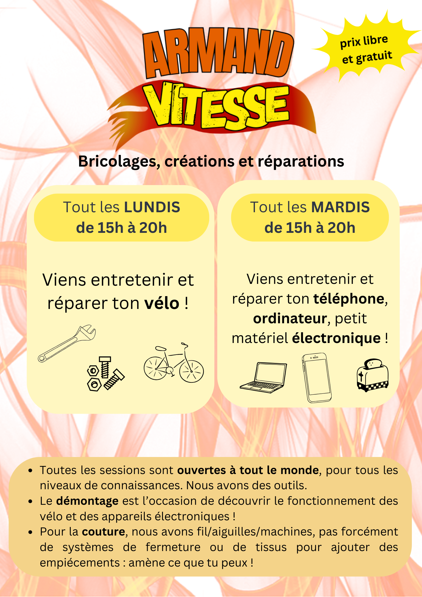

## Mars 2026
#### Mercredi 11 mars de 14h à 19h
Atelier **démontage vélo et désoudure de composants électroniques** 🔥, pour comprendre comment tout fonctionne et récupérer des pièces de rechange utiles pour l’atelier

#### Mercredi 25 mars de 14h à 19h
Atelier **couture** 🧵, répare tes vêtements ou lance-toi dans un projet couture de A à Z !

## Les permanences chaque mois




