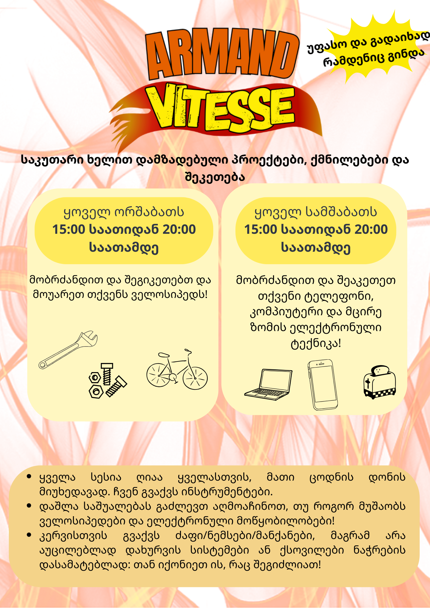

## მარტი 2026
#### ოთხშაბათი, 11 მარტი, 14:00-დან 19:00-მდე
ვორქშოპი **ველოსიპედების დაშლისა და ელექტრონული კომპონენტების დესოლდირების** შესახებ 🔥, რათა გაიგოთ, როგორ მუშაობს ყველაფერი და ვორქშოპისთვის სასარგებლო სათადარიგო ნაწილები მოიპოვოთ
#### ოთხშაბათი, 25 მარტი, 14:00-დან 19:00-მდე
ვორქშოპი **კერვის** შესახებ 🧵, შეაკეთეთ თქვენი ტანსაცმელი ან დაიწყეთ კერვის პროექტი თავიდან ბოლომდე!

## ყოველთვიური მიღებები



