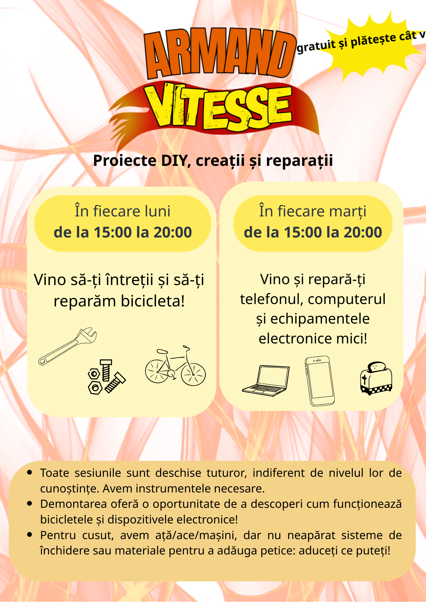

## Martie 2026
#### Miercuri, 11 martie, între orele 14:00 și 19:00
Atelier **de demontare a bicicletelor și dezlipire a componentelor electronice** 🔥, pentru a înțelege cum funcționează totul și pentru a recupera piese de schimb utile pentru atelier
#### Miercuri, 25 martie, între orele 14:00 și 19:00
Atelier **de cusut** 🧵, repară-ți hainele sau lansează-te într-un proiect de cusut de la A la Z!

## Permanențele lunare




